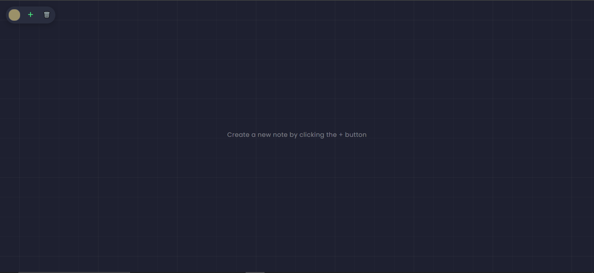

# Sticky Notes App

<div align="center">
  
  <h3>A modern, responsive sticky notes web application</h3>
</div>

## 📝 Overview

Sticky Notes is a lightweight, responsive web application that allows you to create, customize, and organize digital sticky notes. The application is designed to work on both desktop and mobile devices with a focus on simplicity and usability.

All notes are saved locally in your browser, so they persist between sessions. This makes it perfect for quick to-do lists, reminders, or jotting down ideas.

<div align="center">
  
</div>

## ✨ Features

- **Create unlimited notes** with a single click
- **Customize note colors** to categorize your thoughts
- **Drag and drop notes** anywhere on the screen
- **Automatic saving** of all notes to local storage
- **Persistence between sessions** - notes remain even after closing the browser
- **Responsive design** that works on desktop, tablet, and mobile devices
- **Touch-friendly interface** for mobile devices
- **Custom confirmation popups** instead of browser alerts
- **Clean, modern UI** with subtle animations

## 🚀 Live Demo

Try the live demo: [Sticky Notes App](https://stickynotesbyaman.netlify.app/)

## 🛠️ Installation

### Option 1: Direct Download

1. Download the project files
2. Extract them to a folder of your choice
3. Open `index.html` in a modern web browser

### Option 2: Clone the Repository

```bash
git clone https://github.com/yourusername/sticky-notes.git
cd sticky-notes
# Open index.html in your browser
```

## 💻 Usage Guide

### Creating Notes
- Click the **+** button in the top toolbar to create a new note
- Notes are automatically positioned in a staggered pattern

### Customizing Notes
- Use the **color picker** in the toolbar to select a color before creating a note
- Type your content in the note's text area
- Changes are automatically saved

### Moving Notes
- Click and drag any note to reposition it on the screen
- Notes are brought to the front when interacted with

### Deleting Notes
- Click the **X** in the top right corner of any note to delete it (with custom confirmation)
- Use the **trash icon** in the toolbar to delete all notes (with custom confirmation)
- Press **Escape** to cancel deletion or **Enter** to confirm when a popup is shown

### Data Persistence
- All notes are automatically saved to your browser's local storage
- Your notes will be restored when you reopen the application
- Note positions, colors, and content are preserved

## 🔧 Technical Details

The application is built with:

- **HTML5** for structure
- **CSS3** for styling and responsive design
- **JavaScript** (ES6+) for functionality
- **LocalStorage API** for data persistence
- **Custom UI components** including animated popups

No external libraries or frameworks are used, making it extremely lightweight and fast.

### Browser Compatibility

- Chrome 60+
- Firefox 60+
- Safari 10+
- Edge 16+
- Opera 50+
- iOS Safari 10+
- Android Chrome 60+

## 📱 Mobile Features

- Responsive layout that adapts to different screen sizes
- Touch events for dragging notes on mobile devices
- Optimized touch targets for better mobile usability
- Proper viewport settings to prevent unwanted zooming
- Automatic repositioning of notes when rotating devices
- Mobile-friendly confirmation popups

## 🤝 Contributing

Contributions are welcome! If you'd like to contribute:

1. Fork the repository
2. Create a new branch (`git checkout -b feature/amazing-feature`)
3. Make your changes
4. Commit your changes (`git commit -m 'Add some amazing feature'`)
5. Push to the branch (`git push origin feature/amazing-feature`)
6. Open a Pull Request


## 🙏 Acknowledgements

- [Google Fonts](https://fonts.google.com/) for the Poppins font
- Icons used in the application
- The design was inspired by physical sticky notes and modern web applications

---

<div align="center">
  Made with ❤️ by Aman Usmani
</div> 